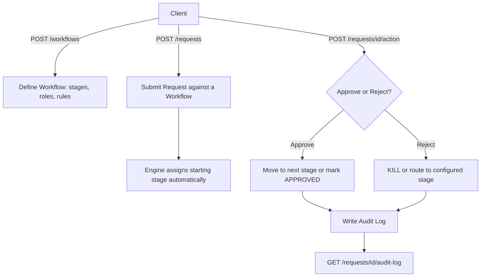

# Universal Approval Workflow Engine ⚙️

A generic, configurable approval-workflow engine built as a REST API. Define any multi-stage approval process — leave requests, purchase orders, vendor onboarding, change requests — entirely through JSON configuration, with **zero code changes per business type**.

Built to demonstrate techno-functional API design: translating real business processes (stages, roles, approval/rejection rules) into a reusable, generic system architecture.

---

## 📚 Table of Contents
- [Problem Statement](#-problem-statement)
- [Core Design Insight](#-core-design-insight)
- [Features](#-features)
- [Architecture](#️-architecture)
- [Tech Stack](#️-tech-stack)
- [Project Structure](#-project-structure)
- [Setup Instructions](#️-setup-instructions)
- [API Reference](#-api-reference)
- [Design Decisions & System Concepts](#-design-decisions--system-concepts)
- [Example: Two Different Businesses, Same Engine](#-example-two-different-businesses-same-engine)
- [Known Limitations & Future Work](#-known-limitations--future-work)
- [Contact](#-contact)

---

## 🎯 Problem Statement

Every business — product, service, manufacturing, or consultancy — runs some version of the same process: **a request moves through a sequence of approvals before it's actioned.** Leave requests, purchase orders, vendor onboarding, change requests — the underlying mechanism (submit → review → approve/reject → next stage) is identical; only the *stages, roles, and rules* differ.

Most systems hardcode this per use case, meaning every new approval process needs new code. This project asks: **can one engine handle all of them, with the workflow itself defined as data?**

---

## 💡 Core Design Insight

**Workflow shape is configuration. Execution logic is code. The two are never mixed.**

Think of it like a SQL stored procedure and its tables: the procedure (engine code) defines *how* data flows and gets validated — but the actual data (which stages exist, who approves what, what happens on rejection) lives entirely in the database, not hardcoded into the logic. Change the data, and the same procedure now serves a completely different case.

Concretely:
- **Roles are configuration, not people.** A stage requires approval from "HR Head" — not from a specific person's name. Who currently holds that role is a separate, swappable mapping.
- **Stage order, rejection routing, and roles are all data**, stored per workflow.
- **The engine (state machine + API) never changes** regardless of which business or process it's serving.

This is proven directly in this repo: two structurally different workflows — a 2-stage Leave Approval and a 3-stage Purchase Order Approval, with different roles and different rejection-routing rules — run on the exact same, unmodified engine code.

---

## 🔧 Features

- **Fully generic workflow definition** — any number of stages, any roles, any approval/rejection routing, defined via API, not code
- **Stateful request lifecycle** — requests move through stages with PENDING → APPROVED / REJECTED terminal states
- **Configurable rejection behavior per stage** — reject can either kill the request or route it back to any earlier stage
- **Complete audit trail** — every approve/reject action is logged with actor, timestamp, and remarks, regardless of outcome
- **Cycle detection at workflow-creation time** — prevents configuring an infinite reject loop (see [Design Decisions](#-design-decisions--system-concepts))
- **Auto-generated interactive API docs** (Swagger UI) — every endpoint is testable without writing a single line of client code

---

## 🏗️ Architecture



### The two-pass workflow creation

Stages reference *other stages* (their "next stage on approve", their "target stage on reject") via foreign keys — but a database can't reference a row that doesn't exist yet. So workflow creation happens in two passes:

1. **Insert all stages first**, without any linking — this generates real, database-assigned IDs
2. **Go back and link** each stage's `on_approve_next_stage_id` and `on_reject_target_stage_id`, now that every ID actually exists

This is the same reasoning behind why you can't print "your backup employee's ID number" on a badge before that employee has been issued their own ID.

---

## 🛠️ Tech Stack

- **Framework:** FastAPI (Python) — chosen specifically for auto-generated, interactive API documentation (Swagger UI), which doubles as a live, testable proof-of-work artifact
- **ORM:** SQLAlchemy — models map directly to relational tables, including self-referencing foreign keys (Stage → Stage) to represent the workflow as a graph
- **Database:** SQLite (prototype-appropriate; swappable for PostgreSQL in production with no code changes to the ORM layer)
- **Validation:** Pydantic — enforces API input/output contracts and rejects malformed requests before they reach business logic

---

## 📂 Project Structure

```bash
approval-workflow-engine/
├── app/
│   ├── main.py                  # FastAPI app entrypoint, table creation
│   ├── database.py              # DB engine, session management
│   ├── models/                  # SQLAlchemy ORM models (Workflow, Stage, Request, AuditLog)
│   ├── schemas/                 # Pydantic request/response contracts
│   ├── routers/                 # API route groups (workflows, requests)
│   └── services/
│       └── workflow_engine.py   # Cycle-detection logic (graph traversal)
├── requirements.txt
└── README.md
```

---

## ⚙️ Setup Instructions

### 1. Clone the repository
```bash
git clone https://github.com/your-username/approval-workflow-engine.git
cd approval-workflow-engine
```

### 2. Create and activate a virtual environment
```bash
python -m venv venv
venv\Scripts\activate        # Windows
source venv/bin/activate     # Mac/Linux
```

### 3. Install dependencies
```bash
pip install -r requirements.txt
```

### 4. Run the server
```bash
uvicorn app.main:app --reload
```

### 5. Open the interactive API docs

http://127.0.0.1:8000/docs

Every endpoint below can be tested directly from this page — no separate client needed.

---

## 📖 API Reference

| Method | Endpoint | Purpose |
|---|---|---|
| `POST` | `/workflows/` | Define a new workflow (name + ordered stages + rules) |
| `GET` | `/workflows/` | List all workflows |
| `GET` | `/workflows/{id}` | Get one workflow's full definition |
| `POST` | `/requests/` | Submit a new request against a workflow (starting stage assigned automatically) |
| `GET` | `/requests/` | List all requests |
| `GET` | `/requests/{id}` | Get one request's current status |
| `POST` | `/requests/{id}/action` | Approve or reject a request at its current stage |
| `GET` | `/requests/{id}/audit-log` | Full action history for one request |

---

## 🧠 Design Decisions & System Concepts

This project intentionally goes beyond CRUD to demonstrate applied system design:

- **State machine modeling** — the approve/reject engine is a formal state machine: defined states, defined transitions, defined terminal conditions
- **Graph-shaped data via self-referencing foreign keys** — each Stage points to other Stages (`on_approve_next_stage_id`, `on_reject_target_stage_id`), forming a directed graph of possible request paths
- **Cycle detection (DFS-style pointer chasing)** — before a workflow is saved, its reject-routing graph is checked for cycles (a stage indirectly routing back to itself), which would otherwise let a request bounce forever. This runs in O(n) time using a visited-set per starting node — functionally equivalent to linked-list cycle detection, since each stage has at most one outgoing reject edge.
- **Dependency injection** — database sessions are created fresh per request (`Depends(get_db)`) and guaranteed to close via a generator pattern, preventing cross-request data leakage
- **Separation of concerns** — models (storage), schemas (API contract), routers (endpoints), and services (business logic) are fully decoupled, so validation rules can change without touching the database layer, and vice versa

---

## 🔁 Example: Two Different Businesses, Same Engine

**Leave Approval** (2 stages):
`Manager Review → HR Review`, HR rejection routes back to Manager.

**Purchase Order Approval** (3 stages):
`Finance Check → Manager Approval → Procurement`, with independently configured rejection routing per stage (Procurement rejects to Manager; Manager rejects to Finance).

Both were created via the same `POST /workflows` endpoint, run through the same `POST /requests/{id}/action` engine, and produce fully independent audit trails — with **no code differences between them.**

---

## 🌟 Known Limitations & Future Work

Documented deliberately, as scope boundaries rather than oversights:

- **No authentication/identity layer** — `actor` and `submitted_by` are currently free-text. A production version needs real user accounts and role-mapping to prevent scenarios like a Manager self-approving their own request.
- **No team/department-specific workflow routing** — multiple workflows can be created per team today, but auto-selecting the correct one based on requester's department isn't implemented.
- **No admin UI** — workflow configuration is currently done via raw JSON through the API; a form-based admin interface would make this accessible to non-technical users.
- **Linear approval chains only** — the engine currently supports one fixed sequence per workflow. Supporting *conditional branching* (e.g., "route to Director approval only if PO amount exceeds ₹1 lakh") would require modeling workflows as a full DAG (Directed Acyclic Graph) and validating them with **topological sort** — a natural v2 extension of the graph-based design already in place.
- **AI-assisted decisioning** — a natural extension given 2026-2027 workflow-automation trends: an LLM-based suggestion layer that flags anomalous requests or recommends auto-approval/escalation, while keeping a human in the loop for the final decision.

---

## 📬 Contact

- **Name:** Sudesh Chaudhari
- **Email:** chaudharisudesh0412@gmail.com
- **LinkedIn:** [Sudesh Chaudhari](https://www.linkedin.com/in/sudesh-chaudhari)